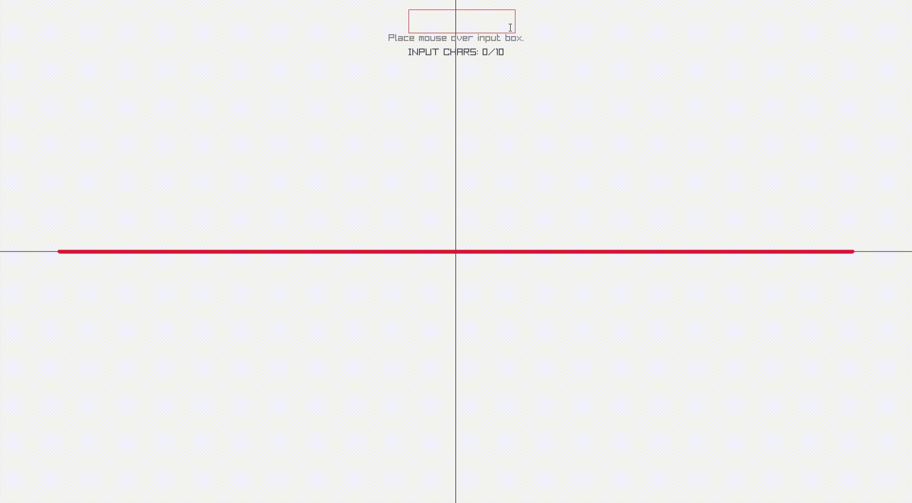
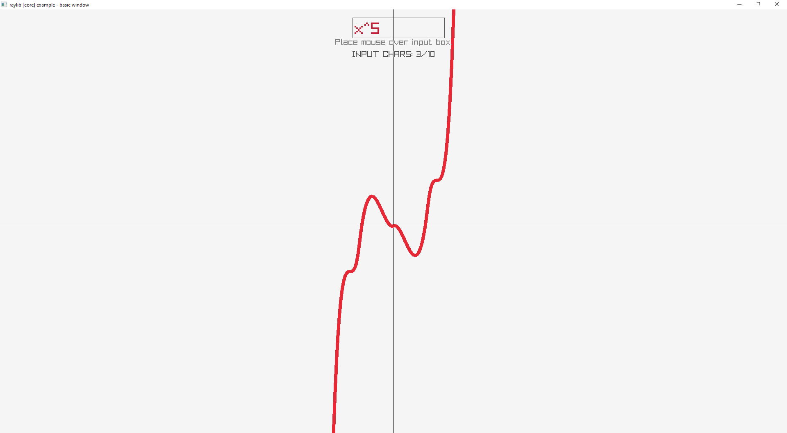
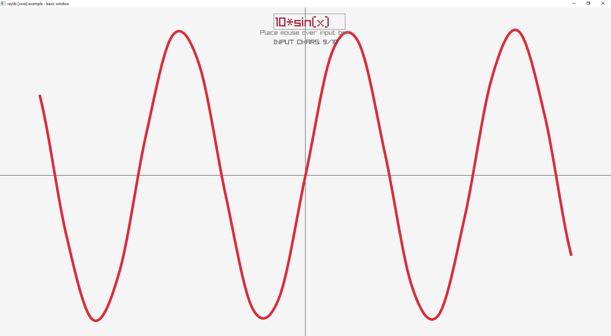

# DesmoC 📈

A simple graphing calculator built in pure C++ with [raylib](https://www.raylib.com/) for real-time graphing and visualization.
## Features

- **Function Plotting**: Visualize functions such as polynomials, trigonometric functions, exponential, and more.
- **Real-time Graph Updates**: View changes to graphs instantly as functions are modified.

## Screenshots

<!-- Include screenshots if available -->




## Prerequisites

- **C++ Compiler**: Make sure you have a C++98 or later compiler.
- **raylib Library**: This project requires [raylib](https://www.raylib.com/) for rendering. You can install it using the instructions on the [raylib installation page](https://github.com/raysan5/raylib#installation).

## Installation

1. **Clone the Repository**:
   ```bash
   git clone https://www.github.com/abdiToldSo/DesmoC
   cd DesmoC
   ```

2. **Install raylib**:
   Follow the instructions on the [raylib installation page](https://github.com/raysan5/raylib#installation) to set up raylib for your operating system.

3. **Compile the Project**:
   Assuming raylib is installed, compile the project with the following command:
   ```bash
   g++ -o DesmoC main.cpp -lraylib -lm
   ```

4. **Run the Application**:
   ```bash
   ./DesmoC
   ```

## Usage

- **Input Functions**: Use the function input section to type mathematical expressions.

## Supported Functions

This calculator can render a variety of functions, including:

- **Basic Arithmetic**: `+`, `-`, `*`, `/`
- **Trigonometric Functions**: `sin(x)`, `cos(x)`, `tan(x)`
- **Exponential and Logarithmic**: `exp(x)`, `log(x)`, `pow(x, y)`
- **Polynomial Functions**: Input polynomials like `x^2 + 3x + 2`

## Acknowledgments

- Thanks to Raysan & his work on [Raylib](https://www.raylib.com/)
- Inspired by my beloved graphing calculator, [Desmos](https://www.Desmos.com/)

